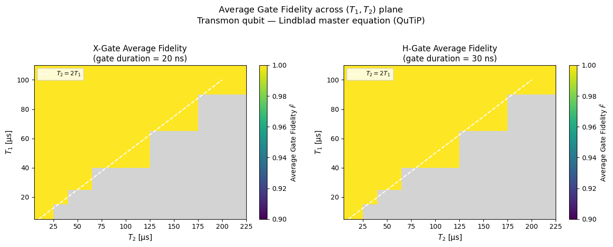

# Transmon Single-Qubit Gate Fidelity under T1/T2 Decoherence

**Simulation of driven transmon qubits as open quantum systems using the Lindblad master equation in QuTiP.**



## Overview

This project models a driven superconducting **transmon qubit** under realistic decoherence (energy relaxation $T_1$ and dephasing $T_2$) and computes the **average gate fidelity** for single-qubit gates (X and Hadamard) across a wide range of coherence times.

It demonstrates how gate performance degrades with finite coherence times and visualizes the fidelity landscape in the $(T_1, T_2)$ plane.

## Features

- Accurate Lindblad master equation simulation with QuTiP
- Realistic drive Hamiltonians for X and Hadamard gates
- Process tomography using 4 probe states
- 2D fidelity heatmap across $(T_1, T_2)$ parameter space
- Error scaling analysis
- Clean, modular, and well-documented code

## Installation

```bash
git clone https://github.com/DhrithiAlex/transmon-gate-fidelity-qutip.git
cd transmon-gate-fidelity-qutip

pip install -e .


